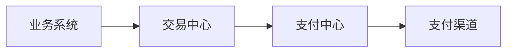

# payment-center

## 项目结构

payment-center
|--- pay // 提供给第三方stater 工具包
|--- payment-center-api // 多模块调用层
|--- payment-center-common 支付中心通用模块
|--- pay-center-channel 支付中心渠道管理

## 项目结构

    controller 控制器进行请求接入以及处理
    service 具体逻辑处理
    manager 通用逻辑处理 及 中间件处理层 如 MQManager
    cache 通用缓存层
    dao 数据操作 如操作 orderMapper 操作redis orderRedismapper 操作 mongo  orderMongoMapper

## 项目包信息

controller
｜---- system 运营系统接口
｜---- api 平台开放暴露的接口

## 系统模块说明

### payment-center-accounting 财务中心

```text
|--- 账务核心 
  ｜--- 记账
  ｜--- 对账
|--- 会记中心
|--- 清结算中心
```

### payment-center-channel 支付渠道网关

```text
|--- 支付渠道接入
```

### 收银支付系统

```text
```

### 项目描述

#### 缓存 KEY 定义规则

1. 服务商商户信息

> payment-center:isv:info:10001

描述
> 支付中心:服务商:信息:服务商标识

2. 防止重复提交

> payment-center:order:submit:lock:10001

#### Redisson KEY 规则

1. 创建服务商用户(用户全局锁)

> payment-center:lock:isv:create:user

2. 更新订单信息(锁订单)

> payment-center:lock:order:update:info:10001

### 系统编号生成规则定义

> 服务商编号

```aiignore
SP12024112200001
SP22024112200002
SP22024112200003
```

固定头信息 SP + 标识位(1 用户注册 4 运营人员添加) + 时间 +5位序列位

> 普通商户编号

```aiignore
M1202504120001
M2202504120002
M2202504120003
```

固定头信息 M + 标识位(2 用户注册 4 运营人员添加) + 时间 +4位序列位(当日自增序列)

> 特约商户

```aiignore
SM120240331000010001
```

固定头信息 SM 标识位(3 用户注册 4 运营人员添加 1 服务商人员添加) + 时间 + 服务商序列位 + 4位序列位(当日自增序列)

### 收单结算系统

### 会员中心

### 商户中心

### 支付核心

待处理支付单
支付记录
支付单 - （1:N）-> 支付记录

### 财务核心

1. 财务记账

支付正向流程




